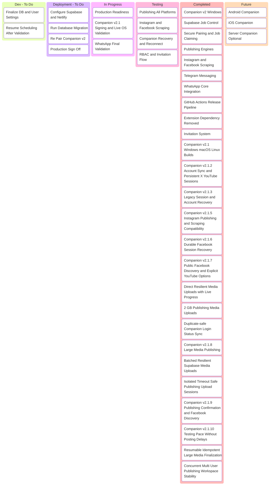
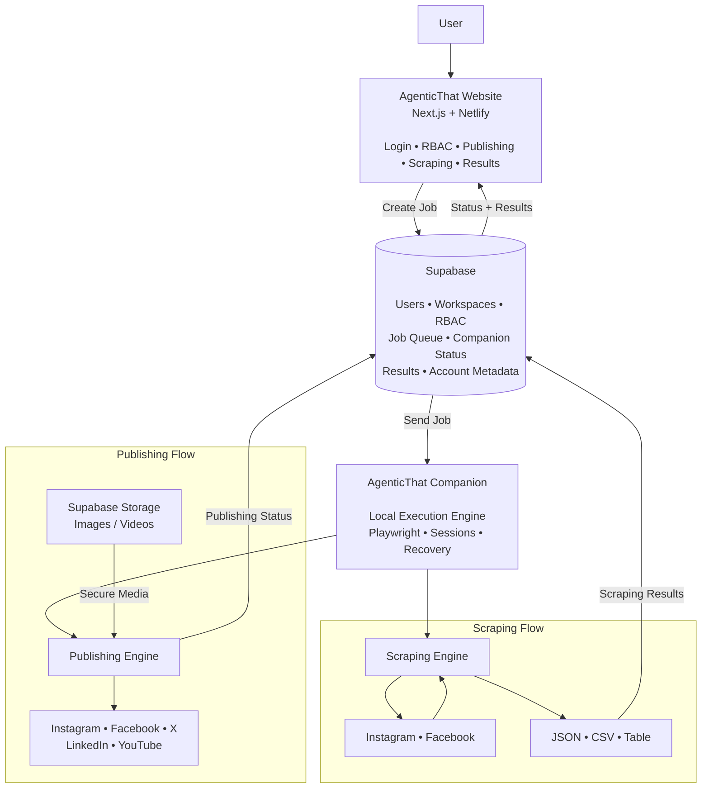

# Agentic That Core Engine Tracker

## Project Tracker




# AgenticThat Architecture



## Main Flow

```text
USER
  │
  ▼
WEBSITE
  │
  │ Creates Publishing / Scraping Job
  ▼
SUPABASE
  │
  │ Sends Job
  ▼
COMPANION
  │
  ├───────────────┐
  │               │
  ▼               ▼
PUBLISHING      SCRAPING
  │               │
  ▼               ▼
Social          Instagram
Platforms       Facebook
  │               │
  └───────┬───────┘
          │
          ▼
       SUPABASE
          │
          ▼
        WEBSITE
```
