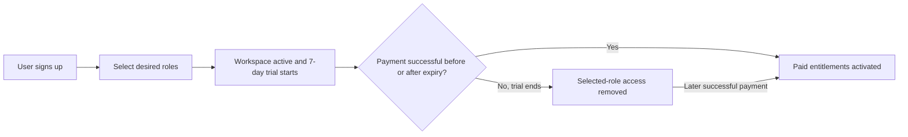

# Self-Service User Onboarding, Trials, and Paid Access

Last updated: 18 August 2026

This runbook describes the self-service onboarding model for selected access and full module access.

## Core rule

Regular-user roles are never assigned by an administrator.

The user chooses their desired roles during signup. Those roles become seven-day trial entitlements immediately, without a payment method. A future payment gateway keeps the selected roles active after successful payment. If payment is not completed, the trial entitlements expire automatically and the user loses access to the selected modules.

Global Admin Center access remains separate. It is bootstrapped only through `PLATFORM_SUPER_ADMIN_EMAILS` and cannot be selected or purchased as a role.

## Onboarding flow



The signup page presents this as a four-step wizard. Account creation occurs only when the user confirms step 3; step 4 confirms that the session and trial are active.

### 1. Account details

The user opens the AgenticThat signup form and enters:

- Full name
- Company/workspace name
- Work email
- Password

No payment method is required.

### 2. Role selection

The signup form loads only roles marked as available for self-service signup and billing. The default choices are:

| Signup role | Access provided |
| --- | --- |
| `Messaging access` | `configure` for WhatsApp and Telegram |
| `Publishing access` | `configure` for Instagram, YouTube, Facebook, X, and LinkedIn publishing |
| `Scraping access` | `configure` for Instagram and Facebook scraping |
| `Full module access` | `configure` for all currently live Messaging, Publishing, and Scraping modules |

`configure` includes `operate` and `view`, allowing a new workspace to connect the external accounts needed to use the selected module.

The backend validates every submitted role ID against the server-side self-service role catalog. A user cannot submit an arbitrary role, hidden role, direct permission, or global-admin flag.

`Full module access` is mutually exclusive with the individual module roles in the wizard. Selecting it clears individual selections; selecting an individual role clears Full Access. This prevents redundant entitlements while preserving the same effective access.

### 3. Payment or free trial

The wizard summarizes the selected roles and offers the seven-day free trial as the current signup path. The paid-access option is visibly unavailable until a verified payment gateway is connected. The UI never treats an unverified browser action as a successful payment.

Selecting **Start 7-day free trial** sends the account details and selected role IDs to the signup API.

### 4. Success

After successful signup:

- The account lifecycle status becomes `active`.
- A new workspace and membership are created automatically.
- `billingStatus` becomes `trialing`.
- `trialStartsAt` is set to the signup time.
- `trialEndsAt` is set to seven days later.
- Each selected role receives an active `trial` entitlement with the same expiry.
- The central session is created.
- A success screen confirms the selected access and trial end date.
- Selecting **Open my workspace** redirects the user to the app store. Closing the completed wizard also continues into the authenticated workspace so the browser is not left with a hidden active session.

There is no administrator approval or administrator role-assignment step.

## Selected-access onboarding

For access to only some product groups, select the corresponding roles.

Examples:

- Select `Messaging access` for WhatsApp and Telegram only.
- Select `Publishing access` and `Scraping access` for those two product groups without Messaging.
- Select only `Scraping access` for Instagram and Facebook scraping.

When multiple roles are selected, their permissions combine using the highest access level for each resource.

## Full-access onboarding

Select `Full module access` to enable every currently live module during the trial.

It is unnecessary to select the Messaging, Publishing, and Scraping roles as well because the full-access role already includes those category grants.

Full module access still does not include:

- Global Admin Center access
- User or role-catalog administration
- RBAC audit history
- Billing-event administration

## Trial expiry

Trial access ends at the exact `trialEndsAt` timestamp, not at the end of the calendar day.

When an authenticated principal is resolved after expiry:

1. `billingStatus` is changed from `trialing`, `payment_pending`, or `past_due` to `expired` if there is no active paid entitlement. A previously canceled subscription remains `canceled`.
2. Trial entitlements are marked inactive.
3. Effective module access becomes `none` unless an active paid entitlement exists.
4. New Telegram, Publishing, and Scraping service tokens cannot be issued for the expired roles.
5. Previously issued service tokens stop working when they expire, within five minutes.

The account remains present and the user can still sign in. Product modules appear locked, allowing the future billing UI to offer payment and restore the originally selected access.

## Billing and payment statuses

Account lifecycle status and billing status are separate:

| Field | Values | Purpose |
| --- | --- | --- |
| Account `status` | `active`, `suspended`, `rejected`; `pending` is retained for legacy records | Controls whether the identity may use the platform at all. |
| `billingStatus` | `trialing`, `payment_pending`, `active`, `past_due`, `canceled`, `expired`, `exempt` | Describes trial/payment state. |

Billing transitions:

| Payment condition | Billing status | Entitlement behavior |
| --- | --- | --- |
| New signup | `trialing` | Selected roles active until `trialEndsAt` |
| Checkout started | `payment_pending` | Existing trial remains active until its expiry |
| Payment succeeded | `active` | Selected roles receive non-expiring `payment` entitlements; trial entitlements are deactivated |
| Renewal/payment failed | `past_due` | Paid entitlements are deactivated; an unexpired original trial may continue |
| Subscription canceled | `canceled` | Paid entitlements are deactivated; any original trial naturally expires at `trialEndsAt` |
| Trial ended without active payment | `expired` | Trial entitlements are deactivated and selected module access becomes `none` |
| Configured global administrator | `exempt` | Billing does not control global-admin module access |

## Future payment-gateway integration

The gateway-specific webhook is intentionally not exposed until a provider is selected. Each provider adapter must:

1. Verify the provider's native webhook signature.
2. Resolve the event to a central `userId` without trusting browser-supplied identity fields.
3. Map the provider event to a supported billing status.
4. Call `applyPlatformPaymentEvent()` from [src/platform/server/auth-store.js](../src/platform/server/auth-store.js).
5. Return success only after the database transaction completes.

The transition function requires:

```js
await applyPlatformPaymentEvent({
  eventId: providerEvent.id,
  provider: "payment-provider-name",
  userId: centralUserId,
  paymentStatus: "active",
  selectedRoleIds,
  details: { /* non-secret provider references */ }
});
```

`eventId` is the idempotency key. Re-delivered provider events do not create duplicate entitlements. On `active`, the function validates the selected roles again, adds paid entitlements, deactivates trial entitlements, records the billing event, updates `billingStatus`, and writes an RBAC audit event.

Never call the transition from an unsigned browser request. Never store card data, payment secrets, or full webhook payloads in RBAC audit records.

## Role-catalog administration

Global administrators manage which role definitions are offered, but do not assign roles to users.

In **Admin Center → Roles & permissions**, an administrator may:

- Create a reusable role and its category/application permission matrix.
- Mark the role as available for self-service signup and billing.
- Edit a non-system role definition.
- Remove a role only when it has no trial or payment history.

System self-service roles are read-only. User cards display billing-controlled entitlements for support and audit purposes, but contain no role-assignment or direct-access-override controls.

## Verify a new trial user

After signup, verify:

1. The user reaches `/apps` without an administrator approval step.
2. The sidebar displays the remaining free-trial time.
3. Selected modules are available.
4. Unselected modules are locked.
5. `GET /api/platform-auth/me` returns `status: "active"`, `billingStatus: "trialing"`, the expected `trialEndsAt`, and the expected effective access map.
6. Product APIs enforce the same selected access server-side.
7. No product asks for a second human username or password.

For full access, verify all live resources resolve to `configure`. For selected access, verify every unselected resource resolves to `none`.

## Verify expiry and payment

Use a test account and test database clock/data rather than changing a production user's dates.

### Expiry scenario

1. Set the test user's `trial_ends_at` to a past timestamp.
2. Resolve the principal through `/api/platform-auth/me`.
3. Confirm `billingStatus` becomes `expired`.
4. Confirm trial entitlements are inactive.
5. Confirm selected resources resolve to `none` and service-token issuance is denied.

### Payment-success scenario

1. Send a verified test provider event to the future gateway adapter.
2. Confirm one `platform_billing_events` record exists for its event ID.
3. Confirm the selected roles have active `payment` entitlements without an expiry.
4. Confirm trial entitlements are inactive.
5. Confirm `billingStatus` is `active` and access continues after the original trial end.
6. Re-deliver the same event and confirm it is treated as a duplicate without changing entitlements.

## Support operations

Administrators may suspend an account, revoke sessions, manage workspaces, inspect entitlements, and review audit history. They must not manually grant a user role.

- Suspension blocks central access immediately and existing service tokens within five minutes.
- Session revocation forces re-authentication but does not change billing entitlements.
- Payment problems must be corrected through a verified payment event or the payment provider's supported recovery flow.
- Changing the permissions inside a self-service role affects every active entitlement using that role, so role edits require the same care as a pricing-plan change.

## Configuration

The trial duration defaults to seven days and can be set explicitly:

```dotenv
PLATFORM_FREE_TRIAL_DAYS=7
```

The accepted range is 1–90 days. Keep production, test, marketing copy, and payment checkout terms aligned.

## Related documentation

- [Centralized Authentication and RBAC](central-auth-rbac-implementation.md)
- [Central Authentication and RBAC Rollout](central-rbac-rollout.md)
